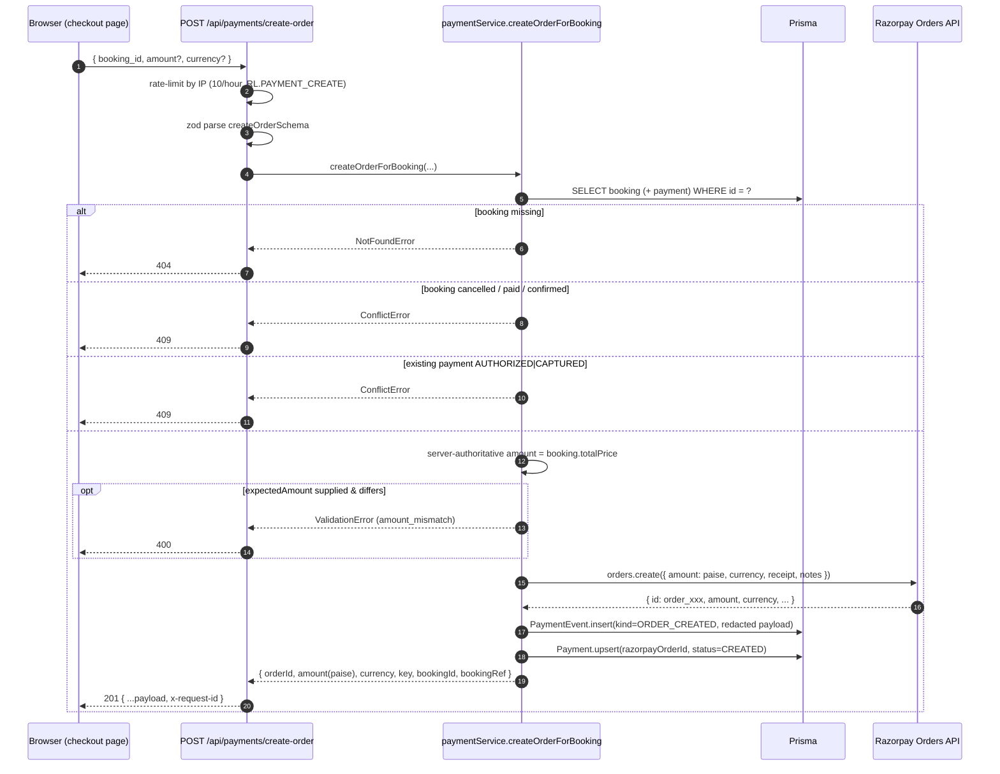
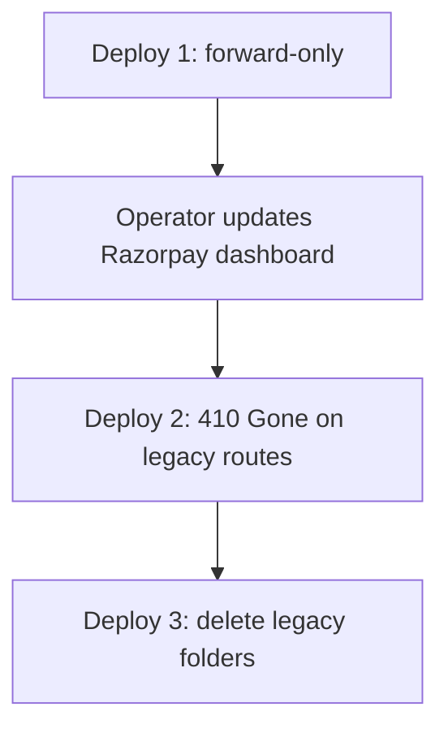
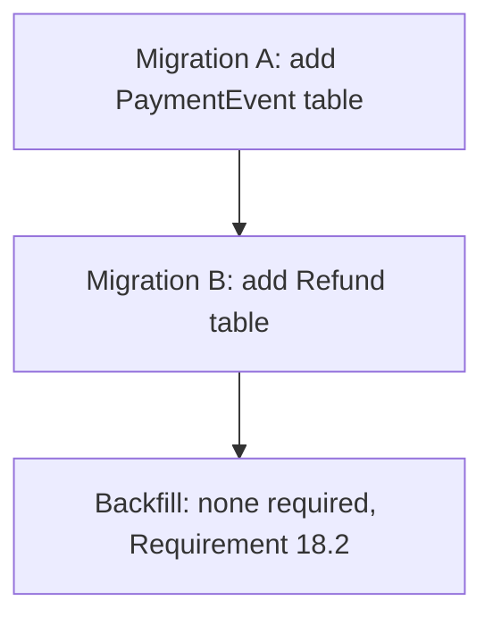
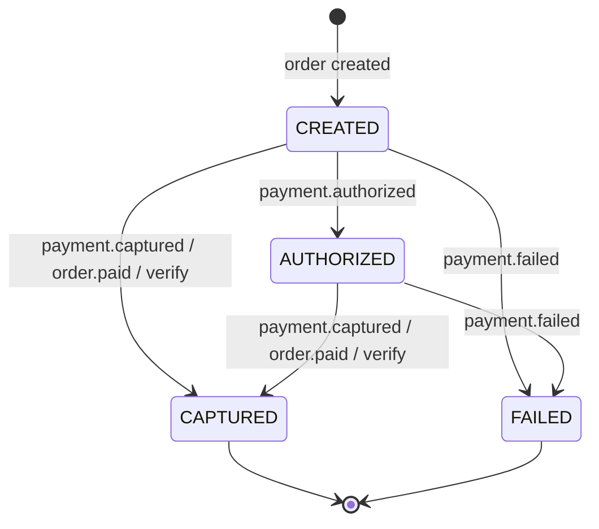
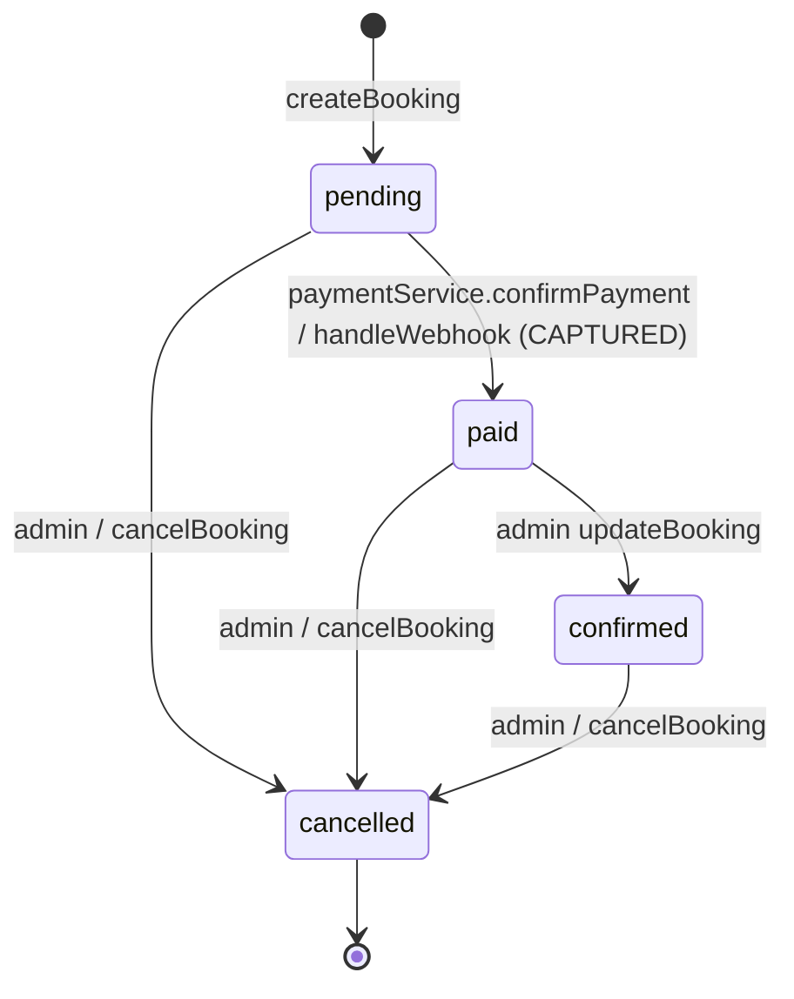
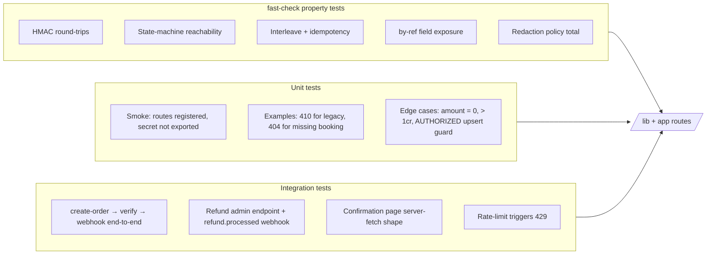

# Design Document

## Overview

This design hardens the Razorpay integration on the Khan Bhai S. site (Next.js App Router + Prisma + PostgreSQL) so that the integration is safe to operate as the source of truth for payments. The core flow — order creation, signature-verified redirect, signature-verified webhook, and the Payment/Booking state machines — is largely correct already. The work in this spec is concentrated on three areas:

1. **Surface consolidation** — collapse the duplicate `/api/payment/*` and `/api/payments/*` URL spaces into a single canonical prefix (`/api/payments/*`), with a forwarding-then-`410 Gone` migration for the legacy paths (Requirement 1, Requirement 18).
2. **Persistent audit + event-level idempotency** — introduce a `PaymentEvent` append-only audit table, keyed on the Razorpay webhook `id` so duplicate deliveries cannot re-fire side effects, and tighten webhook payload validation with Zod (Requirements 7, 9, 10).
3. **Customer-visible truth + refunds** — replace the URL-parameter-driven confirmation page with a server-fetched booking view backed by a public `GET /api/bookings/by-ref/{ref}` endpoint, and add a `Refund` model plus admin-initiated refund flow with `refund.processed` / `refund.failed` webhook handling (Requirements 11, 12).

The existing primitives are preserved: lazy Razorpay SDK init (Requirement 3), HMAC-SHA256 signature verification with `crypto.timingSafeEqual` (Requirements 4, 6), raw-body webhook signature check (Requirement 6), Prisma-transactional state-machine guards with `→ CAPTURED` notifications fired exactly once (Requirements 5, 8, 16), and the structured logger with redacted ids (Requirement 15). This document calls out **"preserve current implementation"** at each touch point so we do not re-describe what is already correct in `lib/payments/razorpay.ts`, `lib/services/paymentService.ts`, and `app/api/payments/webhook/route.ts`.

### Goals

- A single canonical webhook URL registered in the Razorpay dashboard.
- Exactly-once notification semantics under any interleaving of `/api/payments/verify` and `/api/payments/webhook`, including duplicate webhook deliveries.
- A queryable, tamper-evident history of every payment-related event.
- A confirmation page that cannot be spoofed by URL manipulation.
- A small, fast property-based test suite that pins the invariants the rest of the system depends on.

### Non-Goals

- Switching payment providers, supporting non-INR currencies, partial payments, subscriptions, payouts, or Razorpay Route.
- Building an admin UI for refunds in this spec — only the API endpoint and webhook handlers are in scope. The UI can be wired in a follow-up.
- Replacing the in-memory rate limiter with Redis. The current `lib/utils/rateLimit.ts` is retained as-is; we only reuse its existing primitives.

## Architecture

### High-Level Component Map

```mermaid
flowchart LR
    subgraph Browser
        Checkout[/checkout page/]
        Confirm[/confirmation page/]
        RZP_SDK[Razorpay Checkout SDK]
    end

    subgraph NextJS["Next.js App Router (Node runtime)"]
        CreateOrder[POST /api/payments/create-order]
        Verify[POST /api/payments/verify]
        Webhook[POST /api/payments/webhook]
        ByRef[GET /api/bookings/by-ref/:ref]
        AdminRefund[POST /api/admin/payments/:id/refund]
        LegacyForward[/api/payment/* &rarr; 410]
    end

    subgraph Lib["lib/"]
        RZP[lib/payments/razorpay.ts]
        PaySvc[lib/services/paymentService.ts]
        SM[lib/payments/stateMachine.ts]
        Audit[lib/payments/auditLog.ts]
        Logger[lib/logger.ts]
        RL[lib/utils/rateLimit.ts]
    end

    subgraph DB["PostgreSQL via Prisma"]
        Booking[(Booking)]
        Payment[(Payment)]
        PaymentEvent[(PaymentEvent)]
        Refund[(Refund)]
    end

    subgraph External
        Razorpay((Razorpay API))
    end

    Checkout --> CreateOrder
    CreateOrder --> PaySvc
    PaySvc --> RZP --> Razorpay
    PaySvc --> Booking & Payment & PaymentEvent

    Checkout --> RZP_SDK
    RZP_SDK --> Verify
    Verify --> PaySvc

    Razorpay -.webhook.-> Webhook
    Webhook --> PaySvc

    Confirm --> ByRef
    ByRef --> Booking & Payment

    AdminRefund --> PaySvc
    PaySvc --> Refund

    LegacyForward -. 410 Gone .-> Browser
```

### Sequence: Order Creation (Requirements 2, 3, 14)



The PaymentEvent insert and the Payment upsert are committed in the same Prisma transaction so a successful response always implies a durable audit row (Requirement 10.2, 10.4).

### Sequence: Verify after Checkout SDK Redirect (Requirements 4, 5, 16)

```mermaid
sequenceDiagram
    autonumber
    participant SDK as Razorpay Checkout SDK
    participant V as POST /api/payments/verify
    participant Svc as paymentService.confirmPayment
    participant SM as Payment_State_Machine
    participant DB as Prisma
    participant RZP as Razorpay Payments API
    participant N as Notifications

    SDK->>V: { razorpay_order_id, razorpay_payment_id, razorpay_signature, booking_id }
    V->>V: rate-limit by IP (5/hour, RL.PAYMENT_VERIFY)
    V->>V: zod parse verifyPaymentSchema (regex on order/payment/signature)
    V->>DB: PaymentEvent.insert(kind=VERIFY_ATTEMPTED, redacted)
    V->>V: verifyRazorpaySignature (HMAC-SHA256 + timingSafeEqual)
    alt signature invalid
        V->>DB: PaymentEvent.insert(kind=VERIFY_FAILED, error="signature")
        V-->>SDK: 400 { error: "Payment verification failed" }
    else signature valid
        V->>RZP: payments.fetch(payment_id)  [defence-in-depth]
        RZP-->>V: { order_id, amount, status, method }
        V->>V: cross-check order_id + amount(paise)
        V->>Svc: confirmPayment(...)
        Svc->>DB: BEGIN TX
        Svc->>DB: SELECT payment WHERE bookingId=? FOR UPDATE
        Svc->>SM: canTransitionPayment(from, target=CAPTURED|AUTHORIZED|FAILED)
        Svc->>DB: Payment.update(status, razorpayPaymentId, signature, method)
        opt target=CAPTURED && booking.status=pending
            Svc->>DB: Booking.update(status=paid)
        end
        Svc->>DB: PaymentEvent.insert(kind=VERIFY_SUCCEEDED)
        Svc->>DB: COMMIT
        opt this call performed the &rarr; CAPTURED transition
            Svc-->>N: sendPaymentConfirmation + admin email + WhatsApp (fire-and-forget)
        end
        Svc-->>V: { booking, payment, alreadyCaptured }
        V-->>SDK: 200 { ...status, redirect_url }
    end
```

The "this call performed the transition" guard (`result.transitioned` in `confirmPayment`) is the single point that gates notifications; a concurrent webhook racing the verify call cannot also see `transitioned=true` because the row-locked re-read happens inside the same transaction (Requirement 16.2).

### Sequence: Webhook Delivery (Requirements 6, 7, 8, 9, 16)

```mermaid
sequenceDiagram
    autonumber
    participant RZP as Razorpay
    participant W as POST /api/payments/webhook
    participant Z as Zod schema
    participant Svc as paymentService.handleWebhook
    participant SM as Payment_State_Machine
    participant DB as Prisma
    participant N as Notifications

    RZP->>W: POST raw body + x-razorpay-signature
    W->>W: read RAW request.text() (no JSON re-stringify)
    W->>W: enforce Content-Type=application/json, body <= 1 MB
    W->>W: verifyRazorpayWebhookSignature(rawBody, sig)
    alt secret missing
        W-->>RZP: 401 + log webhook.secret_missing
    else signature missing/invalid
        W-->>RZP: 401
    else size > 1 MB
        W-->>RZP: 413
    else ok
        W->>Z: parse JSON + zod webhookEnvelopeSchema
        alt JSON parse fails
            W-->>RZP: 400
        else zod validation fails
            W-->>RZP: 400 + log webhook.malformed_event
        else
            W->>DB: PaymentEvent.insert(kind=WEBHOOK_RECEIVED, eventId=event.id)
            alt event.id present && PaymentEvent(eventId, processed=true) exists
                W-->>RZP: 200 { action: "idempotent:duplicate_event" }
            else
                W->>Svc: handleWebhook(event)
                Svc->>DB: BEGIN TX
                Svc->>DB: SELECT payment WHERE razorpayOrderId=? FOR UPDATE
                alt no payment for order id
                    Svc-->>W: { action: "ignored:unknown_order" }
                else
                    Svc->>SM: canTransitionPayment(from, target)
                    alt illegal transition
                        Svc->>DB: PaymentEvent.insert(kind=WEBHOOK_REJECTED)
                        Svc-->>W: { action: "rejected:illegal_transition" }
                    else
                        Svc->>DB: Payment.update + Booking.update (if &rarr; CAPTURED + pending)
                        Svc->>DB: PaymentEvent.update(processed=true)  -- same row by eventId
                        Svc->>DB: COMMIT
                        opt this call performed &rarr; CAPTURED
                            Svc-->>N: confirmation + admin + WhatsApp (once)
                        end
                        Svc-->>W: { action: "applied:CAPTURED|AUTHORIZED|FAILED" }
                    end
                end
            end
            W-->>RZP: 200 { ok, action }
        end
    end
```

### Concurrency Model (Requirement 16)

The hazard is a webhook arriving at the same moment as the user's browser hits `/api/payments/verify`. Both handlers want to perform the same `→ CAPTURED` transition, update the booking, and send notifications. The design guarantees exactly-once for each side effect through three layered defences:

1. **Single Prisma transaction per state change.** Both `confirmPayment` and `handleWebhook` wrap the read-then-write in `prisma.$transaction`. The Prisma transaction maps to a PostgreSQL transaction with `READ COMMITTED` isolation by default.
2. **Row-level locking inside the transaction.** Inside each transaction we re-read the `Payment` row with `SELECT ... FOR UPDATE` (via `prisma.$queryRaw` for the lock acquisition; the existing service code already re-reads the row — we strengthen that read into an explicit row lock). The two transactions therefore serialize on the same row: whichever begins first wins; the loser sees the post-commit state and finds `status='CAPTURED'`, takes the idempotent branch, and returns its already-captured response without firing notifications.
3. **Status-change as the notification gate.** The `transitioned` flag is `true` only when the row's status was non-terminal at the start of the transaction *and* this transaction wrote `CAPTURED`. Notifications are emitted post-commit, outside the transaction, using fire-and-forget `void` calls so an SMTP failure cannot roll back state (Requirement 5.9).

Pseudocode for the locked read used by both handlers (current code re-reads but does not currently take a lock — this design upgrades it):

```ts
// Inside prisma.$transaction(async (tx) => { ... })
await tx.$queryRaw`SELECT id FROM payments WHERE booking_id = ${bookingId} FOR UPDATE`;
const current = await tx.payment.findUnique({ where: { bookingId } });
const wasTerminal = current?.status === "CAPTURED" || current?.status === "FAILED";
// ...transition logic...
const transitioned = !wasTerminal && finalStatus === "CAPTURED";
```

The existing fast-path idempotency check (`razorpayPaymentId === input.razorpay_payment_id` and `status === CAPTURED`) is **preserved**; the row lock is only the defence-of-last-resort for the small window where the fast path returns a stale read.

## Components and Interfaces

### File Layout (after this spec ships)

| Path | Role | Status |
| --- | --- | --- |
| `lib/payments/razorpay.ts` | SDK init, signature helpers, redactId | preserve current implementation |
| `lib/payments/stateMachine.ts` | New module: Payment + Booking transition tables, `canTransitionPayment`, `canTransitionBooking`, `assertTransition` | **new** |
| `lib/payments/auditLog.ts` | New module: `recordPaymentEvent(kind, payload, ctx)` writing to `PaymentEvent` with redaction | **new** |
| `lib/payments/webhookSchema.ts` | New module: Zod schema for the webhook envelope and entity shapes | **new** |
| `lib/services/paymentService.ts` | Order creation, verify, webhook handling, refund initiation | extend (no rewrite) |
| `lib/schemas/paymentSchema.ts` | Zod schemas for request bodies | extend with `refundSchema`, `bookingByRefParamSchema` |
| `lib/utils/rateLimit.ts` | In-memory rate limiter | preserve current implementation |
| `lib/logger.ts` | Structured logger with redaction | preserve current implementation; add `secret`, `password`, `signature` substrings to the existing redaction set if not already covered |
| `app/api/payments/create-order/route.ts` | POST handler | preserve; only add `recordPaymentEvent(ORDER_CREATED)` |
| `app/api/payments/verify/route.ts` | POST handler | preserve; add `VERIFY_ATTEMPTED` / `VERIFY_SUCCEEDED` / `VERIFY_FAILED` audit writes |
| `app/api/payments/webhook/route.ts` | POST handler | extend: zod parse, event-id idempotency lookup, audit writes |
| `app/api/payment/create-order/route.ts` | Legacy alias | replace export with **410 Gone** handler during the deprecation step |
| `app/api/payment/verify/route.ts` | Legacy alias | replace with 410 Gone |
| `app/api/payment/webhook/route.ts` | Legacy alias | replace with 410 Gone (after the operator updates the dashboard URL) |
| `app/api/bookings/by-ref/[ref]/route.ts` | New: public GET booking by ref | **new** |
| `app/api/admin/payments/[id]/refund/route.ts` | New: admin POST to initiate refund | **new** |
| `app/confirmation/page.tsx` | Confirmation UI | rewrite as Server Component that fetches booking |

### Module: `lib/payments/stateMachine.ts` (new)

Centralises both state machines that today live as `PAYMENT_TRANSITIONS` inside `paymentService.ts` and `BOOKING_STATUS_TRANSITIONS` inside `lib/schemas/bookingSchema.ts`. Hoisting them lets the property-based tests import the tables directly and lets the refund flow reuse `assertTransition` when validating concurrent state changes.

```ts
import type { BookingStatus, PaymentStatus } from "@prisma/client";

export const PAYMENT_TRANSITIONS: Readonly<Record<PaymentStatus, ReadonlySet<PaymentStatus>>> = {
  CREATED:    new Set(["AUTHORIZED", "CAPTURED", "FAILED"]),
  AUTHORIZED: new Set(["CAPTURED", "FAILED"]),
  CAPTURED:   new Set([]), // terminal forward; refunds modeled separately
  FAILED:     new Set([]),
};

export const BOOKING_TRANSITIONS: Readonly<Record<BookingStatus, ReadonlySet<BookingStatus>>> = {
  pending:   new Set(["paid", "cancelled"]),
  paid:      new Set(["confirmed", "cancelled"]),
  confirmed: new Set(["cancelled"]),
  cancelled: new Set([]),
};

export function canTransitionPayment(from: PaymentStatus, to: PaymentStatus): boolean;
export function canTransitionBooking(from: BookingStatus, to: BookingStatus): boolean;

/** Throws ConflictError + logs `*.illegal_transition` on rejection. */
export function assertTransition<S extends string>(
  table: Record<S, ReadonlySet<S>>,
  from: S,
  to: S,
  ctx: { kind: "payment" | "booking"; requestId?: string; subjectId: string }
): void;
```

The transition tables in `paymentService.ts` and `bookingSchema.ts` become re-exports from this module so existing callers continue to compile (Requirement 5.1, 13.1).

### Module: `lib/payments/auditLog.ts` (new)

```ts
export type PaymentEventKind =
  | "ORDER_CREATED"
  | "VERIFY_ATTEMPTED"
  | "VERIFY_SUCCEEDED"
  | "VERIFY_FAILED"
  | "WEBHOOK_RECEIVED"
  | "WEBHOOK_PROCESSED"
  | "WEBHOOK_REJECTED"
  | "REFUND_INITIATED"
  | "REFUND_PROCESSED";

export interface RecordPaymentEventInput {
  kind: PaymentEventKind;
  paymentId?: string | null;
  bookingId?: string | null;
  eventId?: string | null;          // razorpay event.id, when present
  razorpayEventName?: string | null; // e.g. "payment.captured"
  payload?: unknown;                 // will be redacted before persistence
  processed?: boolean;
  error?: string | null;
  requestId: string;
  tx?: Prisma.TransactionClient;     // optional: write inside an existing tx
}

export async function recordPaymentEvent(input: RecordPaymentEventInput): Promise<void>;

/** Idempotency lookup: returns true when a processed=true row exists for eventId. */
export async function isWebhookEventProcessed(eventId: string): Promise<boolean>;
```

`recordPaymentEvent` redacts the payload before writing, replacing values for any key matching `signature`, `secret`, `password`, `token`, or the literal `razorpay_signature` / `x-razorpay-signature` with `"[REDACTED]"`, and rewriting any string that matches `^(order|pay|rfnd)_[A-Za-z0-9]+$` to its `redactId(...)` form (Requirements 10.5, 15.3, 15.4). The redaction policy is shared with `lib/logger.ts` to keep behaviour consistent.

### Module: `lib/payments/webhookSchema.ts` (new)

```ts
import { z } from "zod";

const moneyPaiseSchema = z.number().int().nonnegative().max(10_000_000_000);

const paymentEntitySchema = z.object({
  id: z.string().regex(/^pay_[A-Za-z0-9]+$/).max(64),
  order_id: z.string().regex(/^order_[A-Za-z0-9]+$/).max(64),
  amount: moneyPaiseSchema,
  currency: z.string().length(3),
  status: z.string().max(32),
  method: z.string().max(32).optional(),
  email: z.string().email().max(255).optional(),
  contact: z.string().max(32).optional(),
  error_code: z.string().max(64).optional(),
  error_description: z.string().max(512).optional(),
});

const orderEntitySchema = z.object({
  id: z.string().regex(/^order_[A-Za-z0-9]+$/).max(64),
  amount: moneyPaiseSchema,
  currency: z.string().length(3),
  receipt: z.string().max(64).optional(),
  status: z.string().max(32),
});

const refundEntitySchema = z.object({
  id: z.string().regex(/^rfnd_[A-Za-z0-9]+$/).max(64),
  payment_id: z.string().regex(/^pay_[A-Za-z0-9]+$/).max(64),
  amount: moneyPaiseSchema,
  currency: z.string().length(3),
  status: z.string().max(32),
  notes: z.record(z.string()).optional(),
});

export const webhookEnvelopeSchema = z.object({
  event: z.string().min(1).max(64),
  account_id: z.string().max(64).optional(),
  id: z.string().max(64).optional(), // Razorpay webhook event id (evt_xxx)
  created_at: z.number().int().nonnegative().optional(),
  payload: z.object({
    payment: z.object({ entity: paymentEntitySchema }).optional(),
    order:   z.object({ entity: orderEntitySchema }).optional(),
    refund:  z.object({ entity: refundEntitySchema }).optional(),
  }),
});

export type WebhookEnvelope = z.infer<typeof webhookEnvelopeSchema>;
```

The schema is intentionally non-strict on the top level — Razorpay may add new fields, and we only enforce shape on the entities we read. Unknown event types pass the schema but fall through to `action = "ignored:unhandled"` in `handleWebhook` (Requirement 7.4).

### Webhook Handler: Raw Body Capture in App Router (Requirement 6)

Next.js App Router exposes the raw body via `await request.text()`. The existing handler already does this and the design **preserves it**. The relevant invariants the handler must continue to honour:

- `runtime = "nodejs"` (HMAC requires `crypto`; do not switch to the edge runtime).
- `dynamic = "force-dynamic"` (already set; ensures no caching of POST responses).
- The signature is computed over the *exact* bytes returned by `request.text()`. We never parse + re-stringify before signing.
- After verification, we `JSON.parse(rawBody)` once and pass the result through `webhookEnvelopeSchema.parse(...)`.
- Reject `Content-Type !== "application/json"` with HTTP 415 (new check, Requirement 6.7).
- Reject `Content-Length > 1_000_000` (already enforced after-the-fact via `rawBody.length`; we additionally short-circuit on the header when present, Requirement 6.5).
- Always set `Cache-Control: no-store, max-age=0` and `x-request-id` (already set via `withHeaders`).

### Endpoint: `GET /api/bookings/by-ref/[ref]` (Requirement 11)

A new public read endpoint. The route is a Next.js App Router dynamic segment.

```ts
// app/api/bookings/by-ref/[ref]/route.ts
export async function GET(
  request: NextRequest,
  { params }: { params: { ref: string } }
): Promise<Response>;
```

**Input**: `params.ref` is validated against `^KB-[A-Z0-9]{6,12}$` (the format produced by `generateBookingReference()`). Anything else returns 404 to avoid leaking the existence space.

**Rate limit**: 60 req / IP / 60s using a new `RATE_LIMITS.BOOKING_BY_REF = { limit: 60, windowMs: 60_000 }` profile (Requirement 11.7).

**Output (200)** — only non-sensitive fields (Requirement 11.2, 11.3):

```json
{
  "bookingRef": "KB-AB12CD",
  "guestFirstName": "Itesh",
  "itemName": "Heritage Suite",
  "itemType": "room",
  "status": "paid",
  "totalPrice": "12500.00",
  "currency": "INR",
  "paymentMethod": "upi"
}
```

`paymentMethod` is included only when `status` is `paid` or `confirmed`; otherwise it is omitted. The endpoint **never** returns `guestEmail`, `guestPhone`, the full `guestName`, `razorpayOrderId`, `razorpayPaymentId`, or any other Razorpay identifier. `guestFirstName` is computed server-side as `guestName.split(/\s+/)[0]`.

**Output (404)**: `{ error: "Booking not found" }`. Both an unknown ref and a malformed ref produce the same 404 to avoid an enumeration oracle.

### Confirmation Page: Server Component Redesign (Requirement 11)

`app/confirmation/page.tsx` becomes a Server Component that reads `searchParams.ref`, server-fetches `GET /api/bookings/by-ref/{ref}` via a relative `fetch` (Next.js automatically threads cookies; the endpoint is public so no auth is needed), and renders one of three states:

| Server-fetched `status` | UI state |
| --- | --- |
| `paid` or `confirmed` | "Reservation Confirmed" with item, ref, total, and method. |
| `pending` | "Awaiting payment confirmation — refresh in a moment" with a retry hint. No "Confirmed · paid" copy. |
| `cancelled` | "This booking was cancelled" with link to the homepage. |
| 404 | "Booking not found" page. |

Query parameters `total`, `name`, and `item` are accepted for backwards compatibility but are **not authoritative** (Requirement 11.6); they are only used as initial hints on the client until the server response replaces them.

### Endpoint: `POST /api/admin/payments/[id]/refund` (Requirement 12)

Authenticated via `requireAdmin()` (existing helper; both `SUPERADMIN` and `STAFF` roles allowed — refund authority is delegated to staff). The handler:

1. Loads the `Payment` by id, checks `status === "CAPTURED"`, else 409.
2. Computes `availableForRefund = capturedPaise - sum(prior PROCESSED refunds in paise)`. Requested `amount` (rupees) defaults to the captured amount; if specified and exceeds `availableForRefund / 100`, returns 400.
3. Calls `razorpay.payments.refund(payment.razorpayPaymentId, { amount: paise, notes: { reason, requestId } })`.
4. In a single transaction: inserts a `Refund` row with status `INITIATED`, writes a `REFUND_INITIATED` PaymentEvent.
5. Does **not** modify the Booking — admin must cancel it explicitly via the existing booking cancel endpoint (Requirement 12.8).

Refund status is finalised by the `refund.processed` and `refund.failed` webhook events, which `handleWebhook` now routes to `applyRefundEvent(...)` (a new branch in the existing `handleWebhook` switch). For `refund.processed` we also dispatch `sendRefundProcessedEmail(...)` exactly once, gated on the `INITIATED → PROCESSED` transition (Requirement 12.6).

### Logging, Redaction, and Request Correlation (Requirement 15)

Preserve current implementation. Specifically:

- `logger` (in `lib/logger.ts`) already redacts `signature`, `secret`, `password`, `token`, `RAZORPAY_KEY_SECRET`, `RAZORPAY_WEBHOOK_SECRET`, and the `x-razorpay-signature` header.
- `redactId(id)` (in `lib/payments/razorpay.ts`) returns `prefix_***last4` for any Razorpay id.
- `newRequestId()` produces a 12-char hex correlation id; every payment route generates one at the top of the handler and threads it through `successResponse`/`handleApiError`, which set the `x-request-id` response header (already wired).
- `recordPaymentEvent` reuses the same redaction helper so on-disk `PaymentEvent.payload` matches what the logs say.
- We add a unit-tested `redactPayload(obj)` helper in `lib/payments/auditLog.ts` and use it from both the audit log and the structured logger to remove drift.

### Migration Plan: Legacy Route Deprecation (Requirements 1, 18)

The legacy `/api/payment/*` files today re-export the canonical handlers; they cannot simply be deleted because the Razorpay dashboard webhook URL may still point at `/api/payment/webhook`. The migration runs in three deploys:



| Deploy | Change |
| --- | --- |
| **1 — Forward** | Keep the existing `export { POST } from "@/app/api/payments/..."` aliases. Add a structured `logger.warn("payments.legacy_route_hit", { path })` inside the canonical handlers when the request URL starts with `/api/payment/`. This lets us measure traffic on the legacy paths before flipping. |
| **2 — Mark Gone** | Replace each legacy route's body with a fixed handler returning `{ error: "Gone — use /api/payments/{...}" }` and HTTP 410 (Requirement 1.3). The webhook 410 ships only after the operator confirms the dashboard URL is updated. |
| **3 — Remove** | Delete `app/api/payment/` entirely (Requirement 18.5). |

The Prisma migrations are independent of the route deprecation and ship in deploy 1:



Migrations are additive: no existing `Payment` or `Booking` columns are altered (Requirement 18.1). Existing in-flight `Payment` rows continue to work because the state machine has not changed shape (Requirement 18.2).

## Data Models

### Existing Models — Unchanged

`Booking`, `Payment`, `Room`, `Tour`, `ContactInquiry`, `Admin`, and the enums `BookingType`, `BookingStatus`, `PaymentStatus`, `AdminRole`, `ContactType` are preserved as defined in `prisma/schema.prisma`. The design references their existing field names directly:

- `Booking.bookingRef`, `Booking.totalPrice` (Decimal(10,2)), `Booking.status` (`BookingStatus`).
- `Payment.bookingId` (`@unique`), `Payment.razorpayOrderId` (`@unique`), `Payment.razorpayPaymentId` (`@unique`), `Payment.razorpaySignature`, `Payment.status` (`PaymentStatus`), `Payment.amount` (Decimal(10,2)), `Payment.currency`, `Payment.method`.

### New Enum: `PaymentEventKind`

```prisma
enum PaymentEventKind {
  ORDER_CREATED
  VERIFY_ATTEMPTED
  VERIFY_SUCCEEDED
  VERIFY_FAILED
  WEBHOOK_RECEIVED
  WEBHOOK_PROCESSED
  WEBHOOK_REJECTED
  REFUND_INITIATED
  REFUND_PROCESSED
}
```

### New Enum: `RefundStatus`

```prisma
enum RefundStatus {
  INITIATED
  PROCESSED
  FAILED
}
```

### New Model: `PaymentEvent` (Requirements 9, 10)

```prisma
model PaymentEvent {
  id                String           @id @default(cuid())
  paymentId         String?
  bookingId         String?
  kind              PaymentEventKind
  /// Razorpay webhook event id (e.g. `evt_xxx`). Unique-when-present so
  /// concurrent duplicate deliveries cannot both insert (Requirement 9.5).
  eventId           String?          @unique
  razorpayEventName String?
  /// Redacted JSON payload — see lib/payments/auditLog.ts redactPayload().
  payload           Json?
  processed         Boolean          @default(false)
  error             String?          @db.Text
  /// Correlates with the `x-request-id` response header (Requirement 15.1).
  requestId         String
  createdAt         DateTime         @default(now())

  payment Payment? @relation(fields: [paymentId], references: [id], onDelete: SetNull)
  booking Booking? @relation(fields: [bookingId], references: [id], onDelete: SetNull)

  @@index([paymentId])
  @@index([bookingId])
  @@index([createdAt])
  @@index([kind, createdAt])
  @@map("payment_events")
}
```

The `eventId @unique` constraint is the deduplication primitive: `INSERT ... ON CONFLICT (event_id) DO NOTHING` cannot both succeed for two concurrent deliveries of the same event, so at most one transaction will see itself as the writer (Requirement 9.5). The `processed` flag flips to `true` inside the same transaction that applies the state change, so a row with `eventId=X AND processed=true` is the proof that side effects already ran (Requirement 9.2, 9.4).

The append-only invariant (Requirement 10.6) is enforced by code convention: `recordPaymentEvent` is the only writer, and it never `update`s an existing row except to set `processed=true` exactly once after successful state-change commit. We do **not** add a database trigger for this — the constraint lives in the application's audit-log module, which is tested.

### New Model: `Refund` (Requirement 12)

```prisma
model Refund {
  id               String       @id @default(cuid())
  paymentId        String
  /// Razorpay refund id, e.g. `rfnd_xxx`. Unique so duplicate webhook
  /// deliveries cannot insert twice.
  razorpayRefundId String       @unique
  amount           Decimal      @db.Decimal(10, 2)
  currency         String       @default("INR")
  status           RefundStatus @default(INITIATED)
  reason           String?
  createdAt        DateTime     @default(now())
  updatedAt        DateTime     @updatedAt

  payment Payment @relation(fields: [paymentId], references: [id], onDelete: Cascade)

  @@index([paymentId])
  @@index([status])
  @@index([createdAt])
  @@map("refunds")
}
```

### Payment Model — Add Back-Reference Only

To make Prisma relations work, add the inverse relation field to `Payment`:

```prisma
model Payment {
  // ...existing fields unchanged...
  refunds       Refund[]
  paymentEvents PaymentEvent[]
}
```

`Booking` likewise gets `paymentEvents PaymentEvent[]`. These are reference-only fields that produce no schema column changes (Requirement 18.1).

### Payment State Machine

| From → To  | CREATED | AUTHORIZED | CAPTURED | FAILED |
| ---------- | ------- | ---------- | -------- | ------ |
| **CREATED**    | (no-op) | ✓ | ✓ | ✓ |
| **AUTHORIZED** | ✗ | (no-op) | ✓ | ✓ |
| **CAPTURED**   | ✗ | ✗ | (no-op) | ✗ |
| **FAILED**     | ✗ | ✗ | ✗ | (no-op) |



Refunds do **not** reverse the Payment state — they live on the `Refund` rows joined to a still-`CAPTURED` Payment (Requirement 5.2, 12.8).

### Booking State Machine

| From → To  | pending | paid | confirmed | cancelled |
| ---------- | ------- | ---- | --------- | --------- |
| **pending**   | (no-op) | ✓ (paymentService only) | ✗ | ✓ |
| **paid**      | ✗ | (no-op) | ✓ (admin only) | ✓ |
| **confirmed** | ✗ | ✗ | (no-op) | ✓ |
| **cancelled** | ✗ | ✗ | ✗ | (no-op) |



Writer authority (Requirement 13.2, 13.3): `pending → paid` is performed only inside `confirmPayment` or `handleWebhook`. `paid → confirmed` is performed only by the admin `PATCH /api/bookings/{id}` (or `PUT`) endpoint. The new shared `lib/payments/stateMachine.ts` exposes `assertTransition(...)` which both call sites use; an attempt to run any other transition outside this set throws `ConflictError` and logs `booking.illegal_transition` (Requirement 13.4).


## Correctness Properties

*A property is a characteristic or behavior that should hold true across all valid executions of a system — essentially, a formal statement about what the system should do. Properties serve as the bridge between human-readable specifications and machine-verifiable correctness guarantees.*

The Razorpay integration centres on pure logic (HMAC, state machines), idempotent transitions over a small persistent state, and deterministic input-validation surfaces, all of which are excellent fits for property-based testing. Where requirements are configuration claims (which URL paths exist, which env variables are read), we test them with single-shot smoke or example tests rather than properties; those are listed in the Testing Strategy.

Each property below states a universal claim with explicit "for any" quantification, references the requirements it validates, and is implementable as a property-based test that runs at least 100 randomised iterations.

### Property 1: Payment-signature round-trip

*For any* `order_id` matching `^order_[A-Za-z0-9]+$`, *any* `payment_id` matching `^pay_[A-Za-z0-9]+$`, and *any* non-empty `RAZORPAY_KEY_SECRET`, the signature produced by `HMAC_SHA256(order_id + "|" + payment_id, secret)` is accepted by `verifyRazorpaySignature(order_id, payment_id, signature)`, and any single-bit mutation of `order_id`, `payment_id`, or the signature causes verification to return `false`.

**Validates: Requirements 4.1, 4.2**

### Property 2: Webhook-signature round-trip

*For any* `rawBody: string` and *any* non-empty `RAZORPAY_WEBHOOK_SECRET`, the signature produced by `HMAC_SHA256(rawBody, secret)` is accepted by `verifyRazorpayWebhookSignature(rawBody, signature)`, and any non-empty mutation of `rawBody` (including byte-level edits, JSON re-serialisation, whitespace insertion) causes verification to return `false`.

**Validates: Requirements 6.1, 6.2, 6.4, 6.8**

### Property 3: Verify rejects malformed inputs before crypto work

*For any* `(order_id, payment_id, signature)` where at least one fails the documented format guard (`order_id` not matching `^order_[A-Za-z0-9]+$`, or `payment_id` not matching `^pay_[A-Za-z0-9]+$`, or `signature` length > 256, or `signature` containing a non-hex character), `verifyRazorpaySignature` returns `false` and `crypto.createHmac` is never invoked.

**Validates: Requirements 4.3, 4.4**

### Property 4: Amount-paise equality at every boundary

*For any* `Booking.totalPrice` in the supported range `(0, 10_000_000]` rupees, the value sent to `razorpay.orders.create` is exactly `Math.round(totalPrice * 100)` paise; the value compared during the verify cross-check is computed the same way; and equality is decided over integer paise, not floating-point rupees.

**Validates: Requirements 2.1, 2.2, 4.8, 14.1, 14.6**

### Property 5: Razorpay-side cross-check rejects mismatches

*For any* successful signature verification with input `(razorpay_order_id, razorpay_payment_id)`, if the payment fetched from Razorpay returns a different `order_id` or an `amount` (paise) that differs from `Math.round(Booking.totalPrice * 100)`, the verify handler rejects with HTTP 400 and writes no Payment or Booking row.

**Validates: Requirements 4.7, 4.8**

### Property 6: State-machine reachability and side-effect coupling

*For any* sequence of recognised payment events `e1, e2, …, eN` (where `ei` is one of `verify`, `payment.authorized`, `payment.captured`, `order.paid`, `payment.failed`) applied in order to a Payment in initial status `CREATED` linked to a Booking in initial status `pending`:

- the resulting `Payment.status` is reachable from `CREATED` via `PAYMENT_TRANSITIONS`;
- the resulting `Booking.status` is reachable from `pending` via `BOOKING_TRANSITIONS`;
- if any event would force a transition outside the table, that event leaves both rows unchanged;
- `Booking.status` is `confirmed` in the final state if and only if at least one event is an explicit admin confirm action (no payment-only sequence ever produces `confirmed`);
- if at least one event in the trace causes a `→ CAPTURED` transition and the Booking was `pending`, the final `Booking.status` is `paid`.

**Validates: Requirements 5.1, 5.2, 5.7, 5.8, 8.1, 8.2, 8.4, 8.5, 13.1, 13.2, 13.3, 13.4, 13.5, 18.2**

### Property 7: Interleaved verify, webhook, and refund events are idempotent and exactly-once

*For any* finite sequence `S` of events targeting a single Payment, drawn from `{verify(success), verify(failure), webhook(payment.authorized), webhook(payment.captured), webhook(order.paid), webhook(payment.failed), webhook(refund.processed), webhook(refund.failed)}`, possibly containing duplicates of the same event id and possibly delivered in any order, including concurrent delivery:

- the final state of `(Payment.status, Booking.status, Refund.status, PaymentEvent rows)` is equal to the state produced by applying the unique events of `S` in any total order consistent with their effective causality;
- the count of customer-confirmation emails dispatched equals 1 if any event in `S` produced a `→ CAPTURED` transition, else 0;
- the count of refund-processed emails dispatched equals the number of distinct `refund.processed` events in `S` whose refund row transitioned `INITIATED → PROCESSED`;
- replaying any event in `S` (i.e. an event whose Razorpay `id` already has a `PaymentEvent` row with `processed=true`) produces no additional state changes and no additional emails;
- `order.paid` and `payment.captured` for the same order are mutually de-duplicating: at most one `→ CAPTURED` transition occurs.

**Validates: Requirements 5.3, 5.6, 8.3, 8.6, 8.8, 9.2, 9.5, 12.6, 12.7, 16.2, 16.3, 16.4**

### Property 8: Audit-trail completeness

*For any* successfully-handled order-create, verify, or webhook request, exactly one `PaymentEvent` row is inserted in the same transaction as the state change, with `kind` matching the operation:

| Operation | Outcome | PaymentEvent.kind |
| --- | --- | --- |
| order-create | success | `ORDER_CREATED` |
| verify | before signature check | `VERIFY_ATTEMPTED` |
| verify | success | `VERIFY_SUCCEEDED` |
| verify | failure | `VERIFY_FAILED` |
| webhook | before handler | `WEBHOOK_RECEIVED` |
| webhook | applied transition | `WEBHOOK_PROCESSED` |
| webhook | rejected (illegal/unknown) | `WEBHOOK_REJECTED` |
| refund initiate | success | `REFUND_INITIATED` |
| refund webhook | processed | `REFUND_PROCESSED` |

No `UPDATE` or `DELETE` is ever issued against `payment_events` except the documented `processed = true` flip on the `WEBHOOK_RECEIVED` row.

**Validates: Requirements 9.4, 10.2, 10.3, 10.4, 10.6**

### Property 9: Webhook envelope schema validation

*For any* parsed JSON body conforming to `webhookEnvelopeSchema`, the webhook handler proceeds past validation; *for any* parsed JSON body missing a required field, having a wrong-typed field, or containing an entity id that fails the documented regex (`^pay_…$`, `^order_…$`, `^rfnd_…$`), the handler returns HTTP 400 and writes no `PaymentEvent` of kind `WEBHOOK_PROCESSED`.

**Validates: Requirements 7.1, 7.3**

### Property 10: Webhook transport-layer guards

*For any* webhook request:

- if the body length exceeds 1,000,000 bytes, the response is HTTP 413 and no HMAC computation is performed;
- if the `Content-Type` header is anything other than `application/json` (case-insensitive), the response is HTTP 415;
- regardless of outcome, the response carries `Cache-Control: no-store, max-age=0` and `x-request-id`.

**Validates: Requirements 6.5, 6.6, 6.7, 15.2**

### Property 11: by-ref endpoint exposes only documented fields

*For any* `Booking` row in the database (with or without a linked `Payment`), the JSON response from `GET /api/bookings/by-ref/{bookingRef}` contains a key set that is a subset of `{ bookingRef, guestFirstName, itemName, itemType, status, totalPrice, currency, paymentMethod }` and never contains any of `{ id, guestName, guestEmail, guestPhone, razorpayOrderId, razorpayPaymentId, razorpaySignature, specialRequests }`.

**Validates: Requirements 11.2, 11.3**

### Property 12: Confirmation UI is driven by server truth

*For any* combination of `(serverStatus, urlParams)` rendered on the confirmation page, the visible status copy depends only on `serverStatus`: the literal string "Confirmed · paid" appears in the rendered output if and only if `serverStatus ∈ { "paid", "confirmed" }`, regardless of the values of the `total`, `name`, or `item` URL parameters.

**Validates: Requirements 11.5, 11.6**

### Property 13: Refund initiation guards and atomicity

*For any* `(payment.status, capturedPaise, priorRefundedSum, requested)` tuple sent to `POST /api/admin/payments/{id}/refund`:

- if `payment.status !== "CAPTURED"`, the response is HTTP 409 and no `Refund` row is written;
- if `requested > capturedPaise - priorRefundedSum`, the response is HTTP 400 and no `Refund` row is written;
- otherwise, the response is HTTP 201, exactly one `Refund` row exists for this initiation with `status = INITIATED`, and exactly one `PaymentEvent` of kind `REFUND_INITIATED` is committed in the same transaction.

**Validates: Requirements 12.3, 12.4, 12.5**

### Property 14: Refunds do not mutate Booking status

*For any* successful refund initiation and *any* subsequent `refund.processed` or `refund.failed` webhook delivery for that refund, the linked `Booking.status` value before the refund flow equals the `Booking.status` value after.

**Validates: Requirements 12.8**

### Property 15: Currency rejection

*For any* `currency` value other than the literal string `"INR"` (case-sensitive) supplied to `POST /api/payments/create-order` or `POST /api/admin/payments/{id}/refund`, the response is HTTP 400 and no Razorpay SDK call is made.

**Validates: Requirements 14.3**

### Property 16: Redaction policy is total

*For any* request handled by the payment routes and *any* log line or `PaymentEvent.payload` produced during that request, the resulting bytes contain neither the runtime value of `RAZORPAY_KEY_SECRET` nor the runtime value of `RAZORPAY_WEBHOOK_SECRET` nor the raw value of the `x-razorpay-signature` header nor the raw value of `razorpay_signature`; furthermore, every Razorpay-shaped id (`order_…`, `pay_…`, `rfnd_…`) appears only in the form `prefix_***last4`.

**Validates: Requirements 2.11, 4.5, 4.6, 10.5, 15.3, 15.4**

### Property 17: Request-id correlation

*For any* request to a payment route, the value placed in the `x-request-id` response header equals the `requestId` field present on every log line emitted during that request's handling, equals the `PaymentEvent.requestId` of every audit row written during that request, and equals the `requestId` propagated to error responses.

**Validates: Requirements 15.1, 15.2**

### Property 18: Notification durability

*For any* injected failure of `sendPaymentConfirmation`, `sendAdminPaymentNotification`, or `sendOwnerWhatsAppNotice` after a successful `→ CAPTURED` transition, the DB state of `Payment` and `Booking` after the request equals the DB state of an identical request where notifications succeed; replaying the event after a notification failure does not retry the notification (notifications are not durable; this is the documented exactly-once guarantee).

**Validates: Requirements 5.9**

### Property 19: Razorpay client is a cached singleton

*For any* sequence of `getRazorpay()` calls within a single Node.js process where credentials are configured, all returned references are `===` identical (one underlying SDK instance).

**Validates: Requirements 3.3**

### Property 20: Legacy-route equivalence (transition window only)

*For any* well-formed request body and headers, sending the request to a legacy `/api/payment/{create-order|verify|webhook}` path during the deprecation window produces the same HTTP status, response body, and persisted DB state as sending the same request to the canonical `/api/payments/{...}` path. After the deprecation window, the legacy paths return HTTP 410 with a JSON body identifying the canonical replacement.

**Validates: Requirements 18.4**

## Error Handling

The integration distinguishes four error families, each with a defined response shape and an audit-log effect:

| Family | HTTP code | When | Logged at | PaymentEvent |
| --- | --- | --- | --- | --- |
| **Validation** (zod parse, regex guards, currency, amount bounds) | 400 | Request body fails schema or business sanity | `warn` | `VERIFY_FAILED` for verify; nothing for pre-validation create-order rejects |
| **Auth / forbidden** (admin refund without session) | 401 / 403 | `requireAdmin` throws | `warn` | none |
| **Conflict** (booking already paid, payment in CAPTURED, illegal transition, refund on non-CAPTURED) | 409 | State-machine guard rejects | `warn` (`*.illegal_transition`, `*.duplicate_*`) | `WEBHOOK_REJECTED` when applicable |
| **Not found** (booking or payment) | 404 | DB lookup misses | `info` | none |
| **Rate limited** | 429 + `Retry-After` | `checkRateLimit` returns `ok=false` | `warn` (`*.rate_limited`) | none |
| **Upstream error** (Razorpay 5xx, network) | 502 if order create fails outright; soft-fail with `warn` if verify cross-check fails (signature still valid) | Razorpay SDK throws | `warn` (`*.fetch_failed`) | none for cross-check failure; `VERIFY_FAILED` for outright failure |
| **Internal** (uncaught) | 500 | unexpected | `error` | the in-flight `*_ATTEMPTED` row remains; no `*_PROCESSED` row |

All responses go through `handleApiError(err, { requestId, route })` (existing helper in `lib/errors.ts` and `lib/api-response.ts`); the helper attaches `x-request-id` and standard rate-limit headers and is preserved unchanged. Error message text is generic to avoid leaking internals; the structured logger carries the diagnostic detail.

Specifically for the webhook endpoint, application-level errors (handler exceptions after a valid signature) are caught and the response is downgraded to HTTP 200 with `{ ok: true, processed: false }`, preserving the existing behaviour to avoid Razorpay's automatic retry storm. The `requestId` is logged so the operator can reconcile manually via `/admin/payments`. This is preserve-current.

## Testing Strategy

### Layered Test Suite

The test suite is structured in three layers. The property-based layer is the spine of the suite (see Correctness Properties above); unit and integration tests round out the configuration, error-shape, and end-to-end checks that are not natural property statements.



### Tooling

- **Test runner**: [vitest](https://vitest.dev/) — already implied by the Next.js + TypeScript ecosystem; configured in `vitest.config.ts` with `pool: "forks"` for parallel safety with the in-memory rate limiter.
- **Property-based testing**: [`fast-check`](https://github.com/dubzzz/fast-check). Each property test runs `numRuns: 100` minimum (Requirement 17 implicit). For high-value properties (state-machine reachability, interleaving), `numRuns: 500`. Failing examples are emitted by fast-check verbatim.
- **HTTP integration**: Next.js App Router exposes route handlers as plain functions; we import them directly and call `POST(new NextRequest(...))` instead of spinning up a server. This avoids supertest entirely and runs faster.
- **Database**: a Prisma test sandbox using a dedicated test schema. Each test file gets a unique schema name (`test_<file>_<pid>`), `prisma migrate deploy` applies migrations once at suite start, and per-test transactions roll back via `prisma.$transaction(async (tx) => { ... ; throw ROLLBACK; })`. For pure logic and state-machine properties we do not touch the DB at all — the state machine module is pure.
- **Mocks**: `lib/payments/razorpay.ts` is mocked via `vi.mock` for unit/property tests of `paymentService`; the real client is used only in the order-create integration test, behind a fast-check `fc.pre(env === 'integration')` guard so it does not run in CI by default.
- **Logger spy**: `vi.spyOn(logger, "info"|"warn"|"error")`; the redaction property (P-16) asserts on the captured arguments.
- **Notification spy**: `vi.spyOn(emailService, "sendPaymentConfirmation"|...)` to count exactly-once dispatches.

### Property Test Configuration

- Minimum `numRuns: 100` per property test.
- Each property test header carries the tag comment: `// Feature: razorpay-payment-hardening, Property {N}: {short title}` for traceability back to this design (Requirement 17 implicit).
- Generators live in `tests/generators/` and are shared across files: `bookingArb`, `paymentArb`, `webhookEnvelopeArb`, `eventTraceArb`, `razorpayIdArb`, `paiseArb`. The `eventTraceArb` is the centerpiece for Property 7 — it produces sequences of mixed verify/webhook/refund events with random duplicates and interleaves.
- Shrinking is left to fast-check defaults (built-in shrinkers for arrays, strings, records).

### Unit Tests (Examples and Edge Cases)

- **Signature regex / length guards** (Requirements 4.3, 4.4) — generators in P-3, but also pinned with hand-written examples for the boundary at length 256, all-uppercase hex, mixed case, leading whitespace.
- **HMAC round-trip examples** (Requirement 17.7) — one explicit example test signs a known payload with a fixed secret and asserts the verifier accepts.
- **Razorpay SDK lazy init** (Requirements 3.1, 3.2) — two examples: import without env (no throw), then call `getRazorpay()` (throws with var names).
- **Module export check** (Requirement 3.4) — `expect(razorpayModule).not.toHaveProperty("RAZORPAY_KEY_SECRET")`.
- **Booking already paid / cancelled** (Requirement 2.5) — three examples, one per terminal status.
- **Booking not found / payment not found** (Requirements 2.4, 12.2) — example tests.
- **Webhook secret missing** (Requirement 6.3) — example.
- **Verify Razorpay fetch transient failure** (Requirement 4.9) — example with mocked fetch throwing `ENETUNREACH`.
- **Rate-limit examples** (Requirements 2.13, 4.10, 11.7) — drive the in-memory limiter past its threshold within the window.
- **Log-level mapping** (Requirements 15.5, 15.6) — examples per case asserting the spy was called with the right method.
- **Legacy 410 response** (Requirement 1.3) — example tests for each of the three legacy paths in deploy 2.

### Integration Tests

End-to-end happy and unhappy paths exercising route handlers + Prisma test schema + mocked Razorpay client:

1. **create-order → verify → confirmation page**: success path. Asserts Payment row CAPTURED, Booking paid, one PaymentEvent of each expected kind, exactly one notification dispatch.
2. **create-order → webhook (without verify)**: webhook arrives first. Asserts the same final state; verify call afterwards short-circuits with `already_captured = true` and no extra notifications.
3. **Duplicate webhook delivery**: same event id replayed three times; asserts `PaymentEvent` count for that event id is 1 and notification count is 1.
4. **Refund flow**: admin POST refund → mocked Razorpay returns refund id → webhook `refund.processed` arrives → Refund row PROCESSED, one refund email, Booking unchanged.
5. **Confirmation page**: server-render with a known ref; asserts the rendered HTML contains `Confirmed · paid` for paid bookings, `Awaiting payment` for pending, and `Booking not found` for an unknown ref. Repeats with manipulated URL params and asserts the server response text dominates (Property 12).
6. **Legacy-route forwarding** (deploy 1): POST to `/api/payment/create-order` produces the same DB effect as POST to `/api/payments/create-order` (Property 20).

### What Is Tested vs. What Is Not

- **Unit and property tests** are written for: signature verification, state machines, audit log, redaction, schemas, rate-limit headers, idempotency, and the by-ref response shape.
- **Integration tests** cover end-to-end happy paths and the three big interleavings (verify-first, webhook-first, duplicate webhook).
- **Not tested in this spec**: the actual Razorpay live API (only smoke-checked by an opt-in `LIVE=1` script), the SMTP/WhatsApp transports (those are mocked), the admin refund UI (out of scope), and the Vercel deployment configuration. Operator-facing migration steps (Requirement 18.3) are validated by manual review.

### Coverage Targets

- 100% line coverage on `lib/payments/razorpay.ts`, `lib/payments/stateMachine.ts`, `lib/payments/auditLog.ts`, `lib/payments/webhookSchema.ts`.
- ≥ 90% line coverage on `lib/services/paymentService.ts`.
- ≥ 80% line coverage on the route handlers (the long tail is the `withHeaders` helper and `handleApiError` paths, already covered by their own unit tests).
